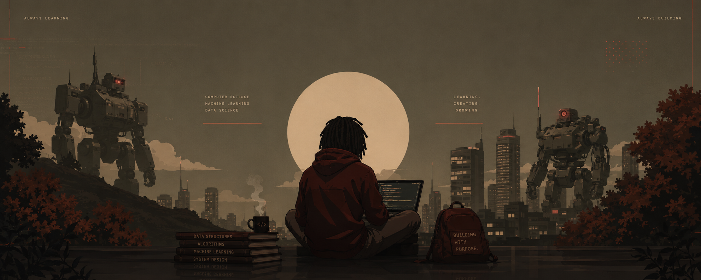

<div align="center">



# Jaylen Bain

<a href="https://github.com/DenverCoder1/readme-typing-svg">
  
</a>

<p>
  <a href="https://github.com/jxylxnn">
    
  </a>
  
</p>

**Computer Science @ Florida A&amp;M University** · AI/ML · Data Science · Predictive Systems

_Build patiently. Learn deeply. Create with purpose._

</div>

---

## About Me

I’m a Computer Science student at **Florida A&amp;M University** building at the intersection of artificial intelligence, machine learning, and data science. I like turning complex ideas and messy data into systems that are useful, understandable, and built with purpose.

Right now, I’m exploring player-performance forecasting, marine heat-stress prediction, AI agents, and data-driven decision systems.

```python
jaylen = {
    "building": ["forecasting systems", "AI agents", "data products"],
    "researching": "marine heat-stress prediction",
    "off_screen": ["sousaphone", "music production", "basketball analytics"],
    "principle": "technical depth + creativity + purpose",
}
```

## Tools of the Craft

<div align="center">

### Languages


### Machine Learning and Data


### Development


</div>

## Selected Work

### NBA Player Prediction System

> Forecasting player performance from historical statistics, game context, and machine learning.

`Python` · `CatBoost` · `Transformers` · `Time Series` · `Feature Engineering`

Studies player history, matchups, team conditions, lineups, and possession-level patterns to produce more informed player-stat forecasts.

### Marine Heat-Stress Research

> Using environmental data to recognize dangerous ocean conditions earlier.

`Python` · `Machine Learning` · `LSTM` · `Time Series` · `Buoy Data`

Explores whether models trained on long-term buoy measurements can warn of marine heat-stress events that threaten coral reefs, fisheries, and coastal communities.

### Polymarket Analytics

> Studying prediction markets through probability, statistics, and data.

`Python` · `Statistics` · `Probability` · `Market Analysis`

Estimates event probabilities, compares market prices with model predictions, and looks for meaningful gaps between the two.


## Experience and Leadership

- **Florida A&amp;M University** — B.S. Computer Science, machine-learning research, and FAMU Marching 100 sousaphone
- **Microsoft** — Software Engineering Intern in Seattle
- **Kappa Kappa Psi** — Southeast District Vice President of Programs and Delta Iota Chapter member

## Beyond the Screen

When I’m away from the terminal, I’m usually playing sousaphone with the **FAMU Marching 100**, producing music in **FL Studio**, or thinking about basketball through the lens of data and forecasting.

## GitHub Garden

<div align="center">

<a href="https://github.com/jxylxnn">
  
</a>

<br><br>


</div>
